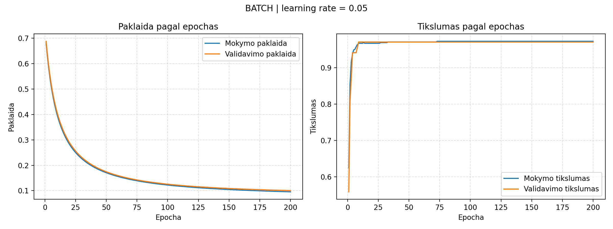
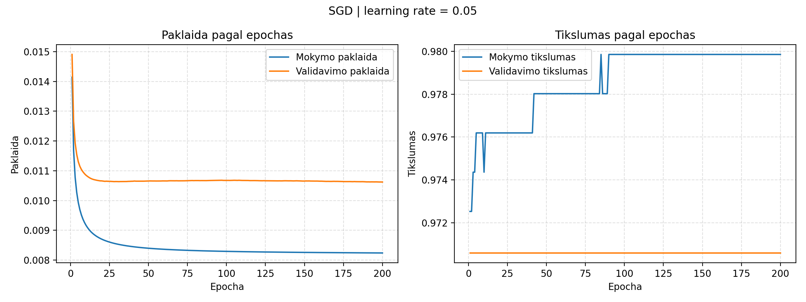
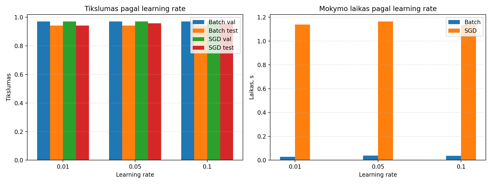

# II laboratorinis darbas. Vieno neurono mokymas sprendžiant klasifikavimo uždavinį

## 1. Darbo tikslas ir uždaviniai

Šio darbo tikslas buvo realizuoti vieną sigmoidinį neuroną dvejetainės klasifikacijos uždaviniui ir ištirti, kaip jo mokymo rezultatus veikia skirtingi gradientinio nusileidimo metodai bei mokymosi greičiai. Darbe remtasi užduoties aprašu ir priedo skaidrėmis, kuriose aprašyta neurono sandara, mokymo eiga, paklaidų skaičiavimas ir `train`, `validation`, `test` aibių paskirtis.

### 1.1. Uždaviniai

Šiame laboratoriniame darbe buvo iškelti tokie uždaviniai:

1. Parsisiųsti ir paruošti `Breast Cancer Wisconsin Original` duomenų aibę.
2. Pašalinti nereikalingą identifikatoriaus stulpelį, ištrinti eilutes su trūkstamomis reikšmėmis ir peržymėti klases į `0` ir `1`.
3. Atsitiktinai permaišyti duomenis ir padalinti juos į mokymo, validavimo ir testavimo aibes santykiu `80:10:10`.
4. Realizuoti vieną sigmoidinį neuroną ir du jo mokymo būdus: paketinį gradientinį nusileidimą (`batch gradient descent`) ir stochastinį gradientinį nusileidimą (`SGD`).
5. Kaupti paklaidas ir klasifikavimo tikslumus po kiekvienos epochos mokymo ir validavimo aibėms, taip pat atskirai apskaičiuoti testavimo rezultatus.
6. Ištirti bent tris skirtingas `learning rate` reikšmes iš intervalo `(0; 1)` ir palyginti jų įtaką rezultatams.
7. Pagal validavimo rezultatus atrinkti geriausią modelio variantą ir pateikti jo charakteristikas.

*Pastaba: šio skyriaus tekstas buvo suredaguotas padedant DI įrankiui, remiantis mano parašytu kodu, užduoties aprašu ir gautais rezultatais.*

## 2. Duomenų parengimas

*Pastaba: šio skyriaus tekstas buvo suredaguotas padedant DI įrankiui, remiantis mano parašytu kodu, užduoties aprašu ir duomenų paruošimo rezultatais.*

### 2.1. Duomenų aibė

Šiame darbe buvo naudojama `Breast Cancer Wisconsin Original` duomenų aibė iš `UCI Machine Learning Repository`. Pirminiame faile yra `699` įrašai ir `11` stulpelių:

- identifikatoriaus stulpelis `sample_code_number`
- devyni diagnostiniai požymiai
- klasės žymė

Naudoti požymiai:

- `clump_thickness`
- `uniformity_of_cell_size`
- `uniformity_of_cell_shape`
- `marginal_adhesion`
- `single_epithelial_cell_size`
- `bare_nuclei`
- `bland_chromatin`
- `normal_nucleoli`
- `mitoses`

Pradinės klasės buvo koduojamos reikšmėmis:

- `2` – nepiktybinis navikas
- `4` – piktybinis navikas

Kadangi darbo tikslas buvo dvejetainė klasifikacija, šios klasės vėliau buvo peržymėtos į `0` ir `1`.

### 2.2. Duomenų valymas

Duomenų paruošimas realizuotas faile `lab2/src/task1_prepare_data.py`, o bendra logika aprašyta faile `lab2/src/breast_cancer_data.py`. Pirmiausia programa patikrina, ar žaliavinis `.data` failas jau yra `lab2/data/raw` aplanke. Jei jo nėra, jis automatiškai parsiunčiamas iš UCI saugyklos. Taip įgyvendinamas užduoties reikalavimas duomenis ne tik paruošti, bet ir parsisiųsti.

Po to atliekami tokie žingsniai:

1. Nuskaitytas pradinis `.data` failas.
2. Pašalintas `sample_code_number` stulpelis.
3. Ištrintos eilutės, kuriose yra simbolis `?`.
4. Požymiai paversti skaitinėmis reikšmėmis.
5. Klasės peržymėtos į `0` ir `1`.
6. Įrašai atsitiktinai permaišyti.

Duomenų valymo rezultatai pateikti 1 lentelėje.

| Rodiklis | Reikšmė |
|---|---:|
| Pradinis įrašų skaičius | 699 |
| Pašalinta eilučių su `?` | 16 |
| Likęs įrašų skaičius | 683 |
| Naudotų požymių skaičius | 9 |

### 2.3. Klasių žymių keitimas

Pagal užduotį klasės buvo peržymėtos taip:

- `2 -> 0`
- `4 -> 1`

Po valymo ir peržymėjimo gautas toks klasių pasiskirstymas:

- klasė `0`: `444` įrašai
- klasė `1`: `239` įrašai

Klasės nėra visiškai subalansuotos, tačiau skirtumas nėra toks didelis, kad užduotis taptų netinkama vieno neurono klasifikavimui.

### 2.4. Duomenų sumaišymas

Po valymo duomenų eilutės buvo atsitiktinai permaišytos. Tai svarbu todėl, kad mokymo pradžioje modelis nematytų tik vienos klasės pavyzdžių. Toks permaišymas ypač svarbus `SGD` metodui, nes šiuo atveju svoriai atnaujinami po kiekvieno įrašo.

Permaišymui naudota fiksuota sėkla `seed = 2026`. Dėl to duomenų paruošimo ir eksperimentų rezultatai yra pakartojami.

### 2.5. Duomenų padalijimas

Paruošta `683` įrašų aibė buvo padalinta į tris dalis santykiu `80:10:10`:

- mokymo aibė `train`: `546` įrašai
- validavimo aibė `validation`: `68` įrašai
- testavimo aibė `test`: `69` įrašai

Šių aibių paskirtis:

- `train` naudojama svoriams ir `bias` reikšmei atnaujinti
- `validation` naudojama modelio pasirinkimui ir mokymo eigos stebėjimui
- `test` naudojama tik galutiniam geriausio modelio įvertinimui

Toks padalijimas atitinka priedo skaidrių logiką: modelis turi būti mokomas su `train`, parenkamas su `validation`, o galutinai vertinamas tik su `test`.

### 2.6. Standartizavimas

Papildomai prieš mokymą požymiams buvo taikytas standartizavimas:

`x_std = (x - mean_train) / std_train`

Čia `mean_train` ir `std_train` buvo skaičiuojami tik iš mokymo aibės. Tie patys parametrai po to pritaikyti validavimo ir testavimo aibėms. Šis žingsnis nebuvo tiesiogiai reikalaujamas užduoties tekste, tačiau buvo pasirinktas tam, kad mokymas būtų stabilesnis ir skirtingo mastelio požymiai nedarytų nevienodos įtakos svorių atnaujinimui.

## 3. Dirbtinio neurono realizacija

*Pastaba: šio skyriaus tekstas buvo suredaguotas padedant DI įrankiui, remiantis mano parašytu kodu ir priedo teorine medžiaga.*

### 3.1. Neurono sandara

Po duomenų paruošimo kiekvienas įrašas turi `9` požymius, todėl neuronas turi `9` įėjimus. Kiekvienam požymiui priskiriamas atskiras svoris, o bendrai tiesinei kombinacijai papildomai taikomas poslinkis `bias`.

Neurono tiesinis atskiriamumas skaičiuojamas taip:

`z = x · w + b`

kur:

- `x` – įvesties požymių vektorius
- `w` – svorių vektorius
- `b` – poslinkis

### 3.2. Sigmoidinė aktyvacijos funkcija

Tiesinei kombinacijai `z` taikoma sigmoidinė aktyvacijos funkcija:

`y = sigmoid(z) = 1 / (1 + e^(-z))`

Sigmoidė paverčia bet kokią `z` reikšmę į intervalą `(0; 1)`. Dėl to jos išėjimą galima interpretuoti kaip modelio polinkį priskirti įrašą vienai ar kitai klasei.

Ši funkcija šiame darbe pasirinkta dėl dviejų priežasčių:

1. Ji tinka dvejetainės klasifikacijos uždaviniui.
2. Ji yra tolydi ir diferencijuojama, todėl leidžia taikyti gradientinį nusileidimą.

### 3.3. Paklaidos funkcija

Pagal priedo skaidrių logiką šiame darbe paklaidai skaičiuoti naudota kvadratinės paklaidos forma:

`MSE = 0.5 * mean((t - y)^2)`

kur:

- `t` – tikroji klasė
- `y` – neurono išėjimo reikšmė po sigmoidės

Ši forma buvo pasirinkta dėl dviejų priežasčių. Pirma, ji atitinka užduoties teorinę medžiagą. Antra, vidurkio naudojimas leidžia tiesiogiai lyginti paklaidas tarp `train`, `validation` ir `test` aibių, nors jų dydžiai skiriasi.

### 3.4. Klasės nustatymas

Galutinė klasė nustatoma suapvalinant sigmoidės išėjimą iki artimiausio sveiko skaičiaus:

- jei reikšmė arčiau `0`, priskiriama klasė `0`
- jei reikšmė arčiau `1`, priskiriama klasė `1`

Kode tam naudojama `np.rint(...)`. Toks sprendimas tiesiogiai atitinka užduoties formuluotę, kurioje reikalaujama sigmoidės išėjimą suapvalinti iki `0` arba `1`.

### 3.5. Pradiniai svoriai ir poslinkis

Pradiniai svoriai buvo generuojami atsitiktinai iš normalaus skirstinio:

`w ~ N(0, 0.1^2)`

Pradinis `bias` buvo lygus `0`. Mažos pradinės reikšmės leidžia pradėti mokymą stabiliau ir sumažina riziką, kad sigmoidės išėjimai pačioje pradžioje pateks į labai prisotintas sritis.

## 4. Gradientinio nusileidimo algoritmai

*Pastaba: šio skyriaus tekstas buvo suredaguotas padedant DI įrankiui, remiantis mano parašytu kodu, užduoties priedu ir gautais eksperimentų rezultatais.*

### 4.1. Gradientinis nusileidimas

Gradientinio nusileidimo esmė yra palaipsniui keisti svorius ir poslinkį taip, kad paklaida mažėtų. Bendras atnaujinimo principas yra:

`parametras_naujas = parametras_senas - learning_rate * gradientas`

Kadangi šiame darbe naudojama `MSE`, mokymo metu apskaičiuojama tarpinė reikšmė:

`delta = (y - t) * y * (1 - y)`

Būtent ji naudojama svorių ir `bias` atnaujinimui tiek `batch`, tiek `SGD` atvejais.

### 4.2. Paketinis gradientinis nusileidimas

Paketinio gradientinio nusileidimo atveju viena epocha naudoja visą mokymo aibę. Pirmiausia apskaičiuojami visų mokymo įrašų išėjimai, po to skaičiuojami gradientai ir svoriai atnaujinami vieną kartą.

Naudotos formulės:

- `delta = (y - t) * y * (1 - y)`
- `grad_w = X^T * delta / n`
- `grad_b = mean(delta)`

Toliau parametrai atnaujinami:

- `w = w - learning_rate * grad_w`
- `b = b - learning_rate * grad_b`

Šio metodo privalumas yra stabilesnė mokymo eiga ir lygesnės epochų kreivės.

### 4.3. Stochastinis gradientinis nusileidimas

`SGD` atveju svoriai atnaujinami po kiekvieno atskiro įrašo. Vienam įrašui skaičiuojama:

- `delta = (y - t) * y * (1 - y)`
- `w = w - learning_rate * delta * x`
- `b = b - learning_rate * delta`

Kadangi atnaujinimai atliekami daug dažniau, `SGD` gali greičiau pajudėti paklaidos mažinimo kryptimi, tačiau jo kreivės dažniausiai būna labiau banguotos.

### 4.4. Paketinio gradientinio nusileidimo epocha

Paketinio gradientinio nusileidimo atveju viena epocha reiškia:

1. Pilną perėjimą per visą mokymo aibę.
2. Vieną bendrą gradientų apskaičiavimą.
3. Vieną svorių ir `bias` atnaujinimą.

### 4.5. Stochastinio gradientinio nusileidimo epocha

Stochastinio gradientinio nusileidimo atveju viena epocha taip pat reiškia pilną perėjimą per visą mokymo aibę, tačiau svoriai per tą epochą atnaujinami po kiekvieno įrašo. Vadinasi, esant tam pačiam epochų skaičiui, `SGD` atlieka daug daugiau parametrų atnaujinimų negu `batch`.

### 4.6. Mokymosi greitis

Mokymosi greitis (`learning rate`) nusako, kokio dydžio žingsniu atnaujinami parametrai. Šiame darbe buvo tiriamos trys reikšmės:

- `0.01`
- `0.05`
- `0.1`

Jei `learning rate` būtų per mažas, mokymas vyktų lėtai. Jei per didelis, mokymas galėtų tapti nestabilus. Dėl šios priežasties skirtingų reikšmių palyginimas yra svarbi laboratorinio darbo dalis.

### 4.7. Algoritmų pritaikymas darbe

Abiem metodams buvo naudojama:

- ta pati duomenų aibė
- tas pats duomenų padalijimas
- tie patys pradinių parametrų generavimo principai
- tas pats epochų skaičius eksperimento metu (`200`)

Po kiekvienos epochos abiem metodams buvo saugoma:

- mokymo paklaida
- validavimo paklaida
- mokymo tikslumas
- validavimo tikslumas

Po geriausios epochos parinkimo papildomai buvo skaičiuojama:

- testavimo paklaida
- testavimo tikslumas
- kiekvieno testinio įrašo prognozė

## 5. Užduočių realizavimas

*Pastaba: šio skyriaus tekstas ir pateikiamų kodo ištraukų atranka buvo parengti padedant DI įrankiui, remiantis mano parašytais `Lab2` failais.*

### 5.1. Duomenų paruošimas

Pirmasis etapas realizuotas faile `lab2/src/task1_prepare_data.py`. Šis failas pasirūpina, kad žaliaviniai duomenys egzistuotų, po to iškviečia paruošimo funkciją, duomenis padalina į `80:10:10` aibes ir išsaugo tiek apdorotą CSV failą, tiek metaduomenis JSON formatu.

Trumpa kodo ištrauka:

```python
def ensure_raw_dataset(raw_path: Path) -> bool:
    if raw_path.exists():
        return False

    raw_path.parent.mkdir(parents=True, exist_ok=True)
    urlretrieve(DATASET_URL, raw_path)
    return True
```

Ši ištrauka parodo, kad užduoties 1 punktas yra savarankiškas: jei duomenų failo nėra, jis parsiunčiamas automatiškai.

### 5.2. Sigmoidinio neurono realizacija

Pats neuronas realizuotas faile `lab2/src/single_neuron.py`. Čia aprašytos sigmoidės, prognozavimo, paklaidos, tikslumo ir mokymo funkcijos.

Pagrindinė logika:

```python
def predict_proba(features: np.ndarray, weights: np.ndarray, bias: float) -> np.ndarray:
    return sigmoid(features @ weights + bias)

def mean_squared_error(labels: np.ndarray, probabilities: np.ndarray) -> float:
    return float(0.5 * np.mean((labels - probabilities) ** 2))

def predict_classes(features: np.ndarray, weights: np.ndarray, bias: float) -> np.ndarray:
    return np.rint(predict_proba(features, weights, bias)).astype(int)
```

Šioje vietoje matome tris svarbiausius žingsnius: apskaičiuojamos tikimybės, pagal jas skaičiuojama paklaida ir galiausiai nustatoma klasė.

### 5.3. Mokymas, validavimas ir testavimas

Antras pagrindinis etapas realizuotas faile `lab2/src/task2_train_and_evaluate.py`. Čia:

1. Paruošiami duomenys.
2. Jie padalinami į `train`, `validation`, `test`.
3. Požymiai standartizuojami.
4. Paleidžiamas neurono mokymas.
5. Apskaičiuojami testavimo rezultatai.
6. Išsaugomi epochų ir testinių prognozių failai.

Trumpa standartizavimo ištrauka:

```python
def standardize_splits(train_x, validation_x, test_x):
    mean = train_x.mean(axis=0)
    std = train_x.std(axis=0)
    std[std == 0.0] = 1.0
    return (
        (train_x - mean) / std,
        (validation_x - mean) / std,
        (test_x - mean) / std,
    )
```

Tai svarbi realizacijos vieta, nes visi eksperimentai buvo atliekami su tais pačiais standartizuotais požymiais.

### 5.4. Eksperimentai

Eksperimentinė dalis realizuota faile `lab2/src/task3_experiments.py`. Jame apibrėžta:

```python
LEARNING_RATES = [0.01, 0.05, 0.1]
EPOCHS = 200
```

Toliau visoms `method x learning_rate` kombinacijoms kviečiama ta pati `run_training(...)` funkcija. Toks sprendimas leidžia palyginti variantus vienodomis sąlygomis. Be skaitinių rezultatų, šiame faile generuojami ir grafikai:

- paklaidos bei tikslumo kreivės pagal epochas
- palyginamasis `learning rate` ir mokymo laiko grafikas

### 5.5. Geriausio modelio atrinkimas

Geriausio modelio atranka realizuota faile `lab2/src/task4_select_best_model.py`. Atranka vykdoma pagal porą:

```python
current_key = (output["best_validation_accuracy"], -output["best_validation_loss"])
```

Tai reiškia:

1. pirmiausia lyginamas didžiausias validavimo tikslumas
2. jei keli variantai turi tą patį tikslumą, pasirenkamas mažesnę validavimo paklaidą turintis modelis

Toks kriterijus tiesiogiai atitinka užduoties reikalavimą geriausią variantą rinkti pagal `validation`, o ne pagal `test`.

### 5.6. Bendras darbo paleidimas

Kad visas darbas būtų paleidžiamas paprastai ir papunkčiui, sukurtas failas `lab2/src/run_all_lab2.py`. Jis iš eilės paleidžia:

1. duomenų paruošimą
2. neurono mokymą ir testavimą
3. eksperimentus
4. geriausio modelio atranką

Tai leidžia vienu paleidimu sugeneruoti visus rezultatus, reikalingus ataskaitai.

### 5.7. Rezultatų generavimas

Darbo metu sugeneruojami šie failai:

- `lab2/data/processed/breast-cancer-wisconsin-clean.csv`
- `lab2/data/processed/task1_data_preparation_metadata.json`
- `lab2/results/task2/.../epoch_metrics.csv`
- `lab2/results/task2/.../test_predictions.csv`
- `lab2/results/task2/.../summary.json`
- `lab2/results/task3/experiment_summary.csv`
- `lab2/results/task3/learning_rate_comparison.png`
- `lab2/results/final_best_model/summary.json`
- `lab2/results/final_best_model/test_predictions.csv`

Dėl šio suskaidymo visos užduoties dalys yra aiškiai atskirtos, o rezultatai lengvai randami.

## 6. Gauti rezultatai

*Pastaba: šio skyriaus tekstas buvo suredaguotas padedant DI įrankiui, remiantis mano sugeneruotais rezultatais iš `lab2/results` katalogo.*

### 6.1. Tyrimo eiga

Tyrimas buvo atliktas laikantis vienodų sąlygų visiems variantams:

- naudota ta pati išvalyta ir permaišyta duomenų aibė
- naudotas tas pats padalijimas į `train`, `validation`, `test`
- naudotas tas pats pradinis `seed = 2026`
- visiems eksperimentams nustatyta `200` epochų
- lyginti du mokymo metodai: `batch` ir `SGD`
- lygintos trys `learning rate` reikšmės: `0.01`, `0.05`, `0.1`

Tokiu būdu visi skirtumai tarp rezultatų atsiranda dėl pasirinkto mokymo metodo arba mokymosi greičio, o ne dėl pasikeitusių duomenų ar kitų parametrų.

### 6.2. Bazinis variantas

Baziniu variantu šiame darbe laikytas `batch` metodas su:

- `learning rate = 0.05`
- `epochs = 200`

Gauti šio varianto svoriai ir poslinkis:

| Parametras | Reikšmė |
|---|---:|
| `w1` | 0.240772 |
| `w2` | 0.336747 |
| `w3` | 0.142702 |
| `w4` | 0.374266 |
| `w5` | 0.308551 |
| `w6` | 0.347500 |
| `w7` | 0.255242 |
| `w8` | 0.300155 |
| `w9` | 0.134334 |
| `bias` | -0.216236 |

Kadangi šio varianto geriausia validavimo epocha sutapo su paskutine, galutiniai rodikliai yra:

- mokymo paklaida: `0.021965`
- validavimo paklaida: `0.022595`
- mokymo tikslumas: `0.970696`
- validavimo tikslumas: `0.970588`
- testo paklaida: `0.024702`
- testo tikslumas: `0.942029`
- mokymo laikas šiame baziniame paleidime: `0.084069 s`

Šis variantas yra geras atskaitos taškas, nes leidžia palyginti, kaip keičiasi rezultatai pereinant prie kitų `learning rate` ir `SGD`.

### 6.3. Paklaidos priklausomybė nuo epochų

Paklaidos kitimas pagal epochas buvo nagrinėtas naudojant sugeneruotus grafikus. Žemiau pateikti du reprezentatyvūs grafikai baziniams `learning rate = 0.05` variantams.



*1 pav. `Batch` metodo paklaidos ir tikslumo kreivės, kai `learning rate = 0.05`.*



*2 pav. `SGD` metodo paklaidos ir tikslumo kreivės, kai `learning rate = 0.05`.*

Iš 1 paveikslo matyti, kad `batch` metodo mokymo ir validavimo paklaidos mažėja tolygiai. Kreivės yra gana lygios, todėl bendra tendencija lengvai pastebima. Tai atitinka teorinę šio metodo savybę: vienas atnaujinimas remiasi visa mokymo aibe.

Iš 2 paveikslo matyti, kad `SGD` paklaidos kreivės yra labiau banguotos. Tai normalu, nes parametrai atnaujinami po kiekvieno įrašo. Vis dėlto bendra tendencija išlieka gera: tiek mokymo, tiek validavimo paklaida mažėja.

Svarbu ir tai, kad šiame darbe nematyti aiškaus persimokymo (`overfitting`) požymių, nes validavimo paklaida nepradeda sistemingai didėti tuo metu, kai mokymo paklaida toliau mažėja.

### 6.4. Klasifikavimo tikslumo priklausomybė nuo epochų

Tikslumo kreivės pateiktos tuose pačiuose 1 ir 2 paveiksluose. Jos rodo, kad abu metodai gana greitai pasiekia aukštą validavimo tikslumą.

Pagrindiniai pastebėjimai:

- `batch` metodo tikslumas kyla tolygiau
- `SGD` metodas aukštą mokymo tikslumą pasiekia greičiau, tačiau kreivė yra triukšmingesnė
- validavimo tikslumas daugelyje eksperimentų gana greitai pasiekia `0.970588`

Tai rodo, kad vieno neurono modeliui šioje duomenų aibėje pakanka palyginti nedaug epochų, kad būtų pasiektas stabilus klasifikavimo tikslumas.

### 6.5. Mokymosi greičio įtaka rezultatams

Pilni eksperimentų rezultatai pateikti 2 lentelėje.

| Metodas | Learning rate | Best epoch | Best val loss | Best val accuracy | Test loss | Test accuracy | Laikas, s |
|---|---:|---:|---:|---:|---:|---:|---:|
| batch | 0.01 | 200 | 0.061419 | 0.970588 | 0.054897 | 0.942029 | 0.028771 |
| batch | 0.05 | 200 | 0.022595 | 0.970588 | 0.024702 | 0.942029 | 0.037985 |
| batch | 0.10 | 200 | 0.016431 | 0.970588 | 0.020730 | 0.942029 | 0.036963 |
| sgd | 0.01 | 149 | 0.010629 | 0.970588 | 0.020719 | 0.942029 | 1.138135 |
| sgd | 0.05 | 200 | 0.010621 | 0.970588 | 0.021246 | 0.956522 | 1.164935 |
| sgd | 0.10 | 200 | 0.010433 | 0.970588 | 0.021635 | 0.956522 | 1.137450 |

Iš 2 lentelės matyti keli svarbūs dalykai:

1. `batch` metodo atveju didėjant `learning rate` mažėja validavimo ir testavimo paklaida.
2. `SGD` metodo atveju validavimo tikslumas visiems trims variantams sutampa, todėl geresnį variantą padeda atskirti validavimo paklaida.
3. `SGD` su `learning rate = 0.01` geriausią epochą pasiekė anksčiau, t. y. `149` epochoje.
4. Geriausią testo tikslumą (`0.956522`) pasiekė `SGD` variantai su `0.05` ir `0.10`.

### 6.6. Paketinio ir stochastinio gradientinių nusileidimų palyginimas

Pagal validavimo tikslumą abu metodai šiame darbe pasirodė labai panašiai, nes visais pagrindiniais eksperimento atvejais buvo gauta ta pati `0.970588` reikšmė. Vis dėlto skirtumai išryškėja, kai lyginame paklaidą ir mokymo eigą.

Pagrindiniai skirtumai:

- `batch` kreivės yra lygesnės ir stabilesnės
- `SGD` kreivės yra triukšmingesnės
- `SGD` atveju gautos mažesnės validavimo paklaidos
- `SGD` davė ir geresnį testavimo tikslumą geriausiuose variantuose

Todėl galima daryti išvadą, kad šioje užduotyje `batch` buvo patogesnis analizuoti, tačiau `SGD` leido gauti geresnį galutinį variantą pagal validavimo kriterijų.

### 6.7. Mokymo laiko palyginimas

Mokymo laiko palyginimas pateiktas 3 paveiksle.



*3 pav. Tikslumo ir mokymo laiko palyginimas pagal `learning rate`.*

Iš rezultatų matyti:

- `batch` metodas veikia maždaug `0.029 - 0.038 s`
- `SGD` metodas veikia maždaug `1.138 - 1.165 s`

Vadinasi, šiame darbe `SGD` buvo apie 30 kartų lėtesnis už `batch`. Tai logiška, nes `SGD` parametrus atnaujina po kiekvieno įrašo, o `batch` tai daro tik vieną kartą per epochą.

Reikia pastebėti, kad laikas yra priklausomas ir nuo konkretaus paleidimo. `task2`, `task3` ir `task4` laikai buvo gauti per atskirus vykdymus, todėl tas pats variantas gali šiek tiek skirtis tarp skirtingų paleidimų. Tačiau bendra tendencija išlieka ta pati: `batch` yra ženkliai greitesnis.

### 6.8. Geriausio varianto pasirinkimas

Pagal užduoties logiką geriausias modelis turi būti parenkamas pagal validavimo rezultatus. Šiame darbe galutinis pasirinkimas buvo daromas pagal:

1. didžiausią validavimo tikslumą
2. jei tikslumas sutampa, mažiausią validavimo paklaidą

Pagal šį kriterijų geriausias variantas buvo:

- metodas: `SGD`
- `learning rate = 0.1`
- bendras epochų skaičius: `200`
- pasirinkta geriausia epocha: `200`

Pasirinkto modelio rodikliai:

| Rodiklis | Reikšmė |
|---|---:|
| `selected_train_loss` | 0.008201 |
| `selected_validation_loss` | 0.010433 |
| `selected_train_accuracy` | 0.979853 |
| `selected_validation_accuracy` | 0.970588 |
| `test_loss` | 0.021635 |
| `test_accuracy` | 0.956522 |
| Mokymo laikas, s | 1.055079 |

Pasirinkto modelio svoriai ir poslinkis:

| Parametras | Reikšmė |
|---|---:|
| `w1` | 1.944525 |
| `w2` | 1.040500 |
| `w3` | 0.217729 |
| `w4` | 0.996659 |
| `w5` | 0.369689 |
| `w6` | 2.350156 |
| `w7` | 0.302214 |
| `w8` | 0.662829 |
| `w9` | 1.313837 |
| `bias` | -0.441227 |

Šis variantas buvo išsaugotas aplanke `lab2/results/final_best_model`.

### 6.9. Best epoch ir last epoch skirtumai

Ataskaitoje svarbu atskirti dvi reikšmių grupes:

- `selected` arba `best` reikšmės – paimtos iš geriausios epochos pagal validavimo rezultatus
- `final` arba `last` reikšmės – paimtos iš paskutinės mokymo epochos

Galutiniam pasirinktam modeliui šios reikšmės sutapo, nes geriausia epocha buvo paskutinė, t. y. `200`.

Vis dėlto ne visi variantai elgėsi taip pat. Pavyzdžiui, `SGD` su `learning rate = 0.01` davė:

| Rodiklis | Reikšmė |
|---|---:|
| `best_epoch` | 149 |
| `selected_validation_loss` | 0.010629 |
| `final_validation_loss` | 0.010635 |
| `selected_validation_accuracy` | 0.970588 |
| `final_validation_accuracy` | 0.970588 |

Šis pavyzdys parodo, kodėl modelio pasirinkimas turi būti daromas ne pagal paskutinę epochą, o pagal validavimo rezultatus.

### 6.10. Testavimo duomenų klasifikavimo rezultatai

Pagal užduotį kiekvienam testiniam įrašui buvo išsaugota:

- prognozuota tikimybė
- prognozuota klasė
- tikroji klasė

Pilna lentelė pateikta faile `lab2/results/final_best_model/test_predictions.csv`. Žemiau parodyta pirmų dešimties testinių įrašų ištrauka.

| Indeksas | Prognozuota tikimybė | Prognozuota klasė | Tikroji klasė |
|---|---:|---:|---:|
| 1 | 0.000571 | 0 | 0 |
| 2 | 0.000750 | 0 | 0 |
| 3 | 0.998082 | 1 | 1 |
| 4 | 0.000647 | 0 | 0 |
| 5 | 0.784356 | 1 | 1 |
| 6 | 0.268131 | 0 | 1 |
| 7 | 1.000000 | 1 | 1 |
| 8 | 0.999998 | 1 | 1 |
| 9 | 0.005421 | 0 | 0 |
| 10 | 0.042941 | 0 | 0 |

Matyti, kad dauguma šių įrašų suklasifikuoti teisingai. Pavyzdžiui, 6 įrašas yra vienas iš atvejų, kai modelis suklysta: prognozuota klasė yra `0`, nors tikroji klasė yra `1`.

## 7. Išvados

*Pastaba: šio skyriaus tekstas buvo suredaguotas padedant DI įrankiui, remiantis mano gautais rezultatais.*

1. Iš pradinės `699` įrašų duomenų aibės, pašalinus `16` eilučių su trūkstamomis reikšmėmis, liko `683` tinkami įrašai su `9` požymiais.
2. Sukurtas vienas sigmoidinis neuronas sėkmingai išsprendė dvejetainės klasifikacijos uždavinį, naudodamas kvadratinę paklaidą `MSE = 0.5 * mean((t - y)^2)`.
3. Abu mokymo metodai, `batch` ir `SGD`, leido pasiekti aukštą validavimo tikslumą, tačiau jų mokymo eiga skyrėsi: `batch` buvo stabilesnis, o `SGD` triukšmingesnis.
4. Pagal mokymo laiką `batch` metodas buvo ženkliai greitesnis, tačiau pagal validavimo paklaidą geriausias variantas buvo gautas su `SGD`.
5. Geriausiu modeliu pagal validavimo rezultatus tapo `SGD` su `learning rate = 0.1`.
6. Pasirinktas geriausias modelis pasiekė `0.970588` validavimo tikslumą ir `0.956522` testo tikslumą.
7. Gauti rezultatai rodo, kad net vienas sigmoidinis neuronas gali gana tiksliai spręsti šį klasifikavimo uždavinį, jei duomenys yra tinkamai paruošti ir modelis mokomas nuosekliai.

## Priedai

Prie galutinės Word ataskaitos siūloma pridėti:

- 1 paveikslą: `batch` kreives `lab2/results/task3/batch_lr_0_05_curves.png`
- 2 paveikslą: `SGD` kreives `lab2/results/task3/sgd_lr_0_05_curves.png`
- 3 paveikslą: `learning_rate_comparison.png`
- 2 lentelę su visų eksperimentų rezultatais
- pilną testinių prognozių lentelę arba jos ištrauką
- trumpas kodo ištraukas iš `task1_prepare_data.py`, `single_neuron.py`, `task2_train_and_evaluate.py` ir `task4_select_best_model.py`
